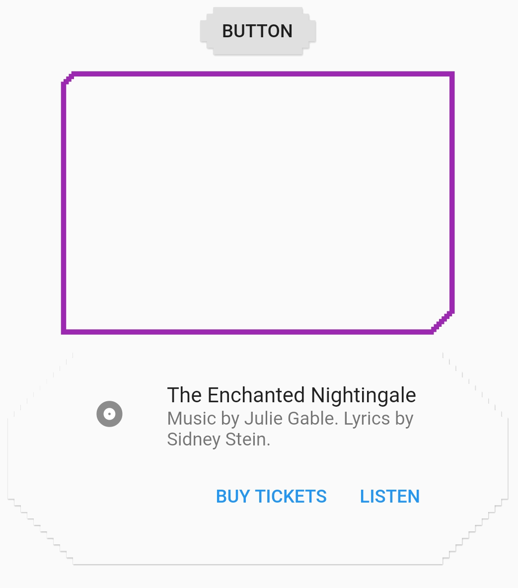

# pixel_border

[](https://pub.dev/packages/pixel_border)  

A package to render shapes or borders of widgets with pixelated corners.

## Usage

PixelBorder can be used the same way built-in ShapeBorders are, by setting the shape property on any Widget supporting it.

Some examples include:

Drawing an orange square border where all corners are rounded and drawn with "pixels" of size 2.0

```dart
Container(
  decoration: ShapeDecoration(
    shape: PixelBorder.solid(
      borderRadius: BorderRadius.circular(4.0),
      pixelSize: 2.0,
      color: Colors.orange,
    ),
  ),
  height: 42.0,
  width: 42.0,
);
```

Setting the default button shape in MaterialApp:

```dart
MaterialApp(
  theme: ThemeData(
    buttonTheme: ButtonThemeData(
      shape: PixelBorder.shape(
        borderRadius: BorderRadius.circular(10),
        pixelSize: 5,
      ),
    ),
  ),
);
```

For corners to be drawn properly, `PixelBorder` requires the radii defined in `borderRadius` to be a multiple of `pixelSize`.


